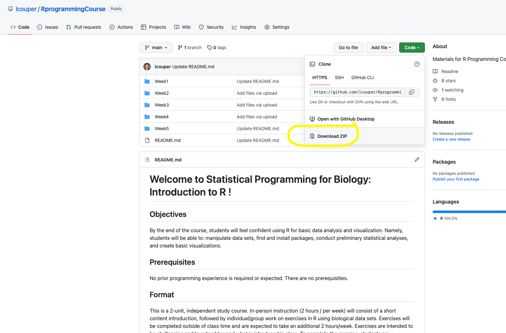

# Week 1 Practice Exercises #

Important notes before starting: 
- Feel free to write out the code/answers for the questions below if that's helpful to you, or feel free to just use these exercises to guide your exploration (no one is grading you!)

- You are encouraged to use any and all tools available to you, especially the internet! You are not expected to "know" how to do these problems yet or to memorize any of these functions or steps. Virtually everyone who uses R is constantly using the internet/ R help tools for reference and guidance

- For nearly all of these problems, there are many different ways you could solve them. In the answer key, I provide one (or sometimes two) potential ways, but these aren't necesssarily the only "right" answer

- You'll want to download the course materials from github before starting. This will let you access the datasets and practice exercise keys more easily.  To do this, navigate to the main course page. Hit the green "Code" button on the top right. Click "Download Zip". Save the materials wherever you like on your computer.



## 1. Simulating data ##
### Useful functions: sample(), rnorm() 

1.1) You want to simulate the outcome of 50 random coin tosses. How could you do this in R?


1.2) You want to simulate the lengths (in centimeters) of Arabidopsis (a type of plant) stems. 
You want 20 values ranging from 3.4 to 11.6 (i.e. non-integer values must be possible). 
How could you do this?
Hint: The "sample" function only works for integers so you will need to find a different function.


1.3) You have a dataset that you want to compare to normally distributed data with mean = 0 and standard deviation = 1. 
How would you sample 100 values from a normal distribution of mean 0 and standard deviation (sd) 1?
Hint: Use the rnorm function. Use ?rnorm for help on how to use it!


1.4) You have a dataset containing 6 treatment groups and participants 1-10 in each group. 
Create a vector called "Indices" that contains the values 1:10 repeated 6 times. Hint: use the 'rep' function


1.5) If instead of having the values be collated (1,2,3... 1,2,3.... 1,2,3...), 
you want the values uncollated (1,1,1,1....2,2,2,2....3,3,3,3), how would you do this?
Hint: Google the "rep" function and explore the possible arguments to pass to it

1.6) You want to create an empty matrix to later add simulated values to.
Create a matrix called "Empty" that contains 3 rows and 5 columns using the following code:
```
Empty = matrix(0, nrow = 3, ncol = 5)
```

1.7) Let's say you obtained the following data from a simulation:
```
35,8,1,9,12
```
Store this data in a new variable called "Simulated" and replace row 1 of the "Empty" dataset with "Simulated"


## 2. Importing and exploring data: Mosquito Data example ##

### Useful functions: read.csv(), mean(), max(), which() ###

2.1 Download and import the "Anopheles_Data.csv" data set. Save it as a variable in R called "Anopheles"
Note: There are column names in this dataset (so set header = TRUE).
This dataset contains information about the number of *Anopheles quadrimaculatus* (the malaria vector in eastern US) at various sites in Florida.
The "value" column indicates how many mosquitoes were found in the trap at that day/location.

2.1) What is the average number of mosquitoes found at all traps/locations?

2.2) What is the maximum number of mosquitoes found? 

2.3) At which location did this max value of mosquitoes occur? (Hint look-up the 'which' function)

2.4) Create a new variable called Locations and set it equal to the sample_location_info column

2.5) How many unique locations were sampled?

2.6) Split up the dataset into sites sampled in Northern and Southern Florida using the following commands:
```
NorthF = Anopheles[Anopheles$sample_lat_DD >= 27.45672,]
SouthF = Anopheles[Anopheles$sample_lat_DD < 27.45672,]
```

2.7) Are there more mosquitoes in the Northern or Southern sample sites?

2.8) Is the difference in mosquitoes statistically significant? (Use the t.test function on the NorthF$value and SouthF$value)

2.9) In addition to calculating summary statistics on the whole dataset or a pre-determined subset, you can also calculate summary stats based on values in other columns. 
For example, you could calculate the mean mosquito abundance based on the sample site with the following code:
```
aggregate(Anopheles$value ~ Anopheles$sample_location_info, FUN = mean)
```
The first argument indicates that we want the "value" column of the *Anopheles* data frame to be broken up based on the "sample_location_info" column
The second argument indicates that we want the mean calculated for each of the subsets

2.10) Adapt the above code to calculate the average mosquito abundance by sample month.
Store this information in a new variable "MonthlyMos"

2.11) Which months had the highest mosquito abundance? Something odd is going on with the dataset. Take a look at the values listed in the sample_month and see if you can figure out what it is. Hint: How many data points were taken in January and February?


## 3. Importing and exploring data: Disease example ##
### Useful functions: head(), summmary(), unique() ###

3.1) Download and import the "bacteria_data.txt" file in R using the read.table command or the import dataset tool
The dataset contains info about the presence of the bacteria *H. influenzae* in children with otitis media in Australia

The dataset contains 220 rows and the following columns:
- y: presence or absence: a factor with levels n and y.
- ap: active/placebo: a factor with levels a and p.
- hilo: hi/low compliance: a factor with levels hi amd lo.
- week: week of test.
- ID: subject ID: a factor.
- trt: a factor with levels placebo, drug and drug+, a re-coding of ap and hilo.

We'll talk more about data classes next time, but for now, run the code below to make sure the y and ap columns are "factors"
```
Bacteria$y = as.factor(Bacteria$y)
Bacteria$ap = as.factor(Bacteria$ap)
```

3.2) Use the 'head' function on this dataset to get a quick sense for what the dataset contains

3.3) How many patients were in the placego group? How many in the active group?

3.4) How many unique participants are included in this data set?

3.5) Separate the patients in the active vs placebo group and assign these to new variables using the following command 
```
placebo = Bacteria[Bacteria$ap == "p",]
active = Bacteria[Bacteria$ap == "a",]
```

3.6) Now use the summary function on these two variables, placebo and active, to see how the presence of bacteria (in the "y" column) differed between these two groups.

3.7) What percentage of the actively treated patients had bacteria present?

3.8) What percentage of the patients in the placebo group had bacteria present?


## 4. Importing and exploring data: CA Animals example ##
### Useful functions: colSums(), rbind(), cbind(), rownames(), dim(), head(), var(), sqrt() ###

4.1) Download, import and view the Animals dataset (CA_Animals.csv), designating the first column to be the "row names"
Example: 
``` 
Animals = read.csv("~/Downloads/CA_Animals.csv, header = TRUE, row.names = 1)
```

4.2) Use the "colSums" function to figure out which animal is most abundant across all the sites

4.3) How many total animals are at Site E? You can do this first by making the 5th row of the dataset its own variable and calling the sum function on that variable, or doing it all in one line (i.e, using the sum function on the 5th row without assigning it as a new variable)

4.4) Create a new vector of data called "Chipmunks" that has the values: 2, 4, 2, 0, 5, 1

4.5) Add 'Chipmunks' to the Animals data frame using the following code:
```
Animals = cbind(Animals, Chipmunks) 
```

4.6) What would have happened if we had instead wrote: Animals = cbind(Chipmunks, Animals) ? 

4.7) Adapt the method above to add a new site to the Animals data frame.
First create a variable called "SiteG" and assign to it the values: 3,5,4,8,0,1,2,1.
Note you will need to use the rbind function this time instead of cbind

4.8) View the animals dataset. What looks different about this row from the rows before it?

4.9) Examine the names of the rows for the dataset using the following code:
```
rownames(Animals) 
```

4.10) Change the 7th entry in the rownames of Animals to be "SiteG" using the following code:
```
rownames(Animals)[7] = "SiteG"
```

4.11) We later realized the "Pinyon Mouse" was mis-identified and is actually the California mouse.
Change the column name for column 3 to the correct species.

4.12) For an upcoming analysis, we only want to look at the data for small mammals, so we need to remove the lizard data.
Remove this column and assign the subsetted data to a new variable:

```
SmallMammals = Animals[,-4]
```

4.13) It turns out that sites B & C were affeced by a wildfire and we want to remove these site from our analysis.
Remove these rows and save the subsetted data into a new data frame called "NoFire"

4.14) Check that you properly removed these rows by examining the dimensions of NoFire using the 'dim' function

4.15) We now want to combine the two mouse species columns for futher analysis. 
Use the following code to create a new variable "mouse" which contains the sum of the Pinyon mouse & California mouse observations

```
Mouse = NoFire$DeerMouse + NoFire$CaliforniaMouse
```

4.16) What is another way that you could have done this?

4.17) Remove the DeerMouse and CaliforniaMouse columns. Add in the "Mouse" variable as a column to a new data frame called "SmallMammals2"

4.18) Use the 'head' function on SmallMammals2 to make sure you created the new data frame correctly

4.19) How does the variance of mice found at sites compare to the variance of voles?

4.20) Before modeling the Small Mammal data, we want to square root transform all abundance values.
Create a new variable called "SqSm" that contains the square-root of the values from the SmallMammals2 data frame


