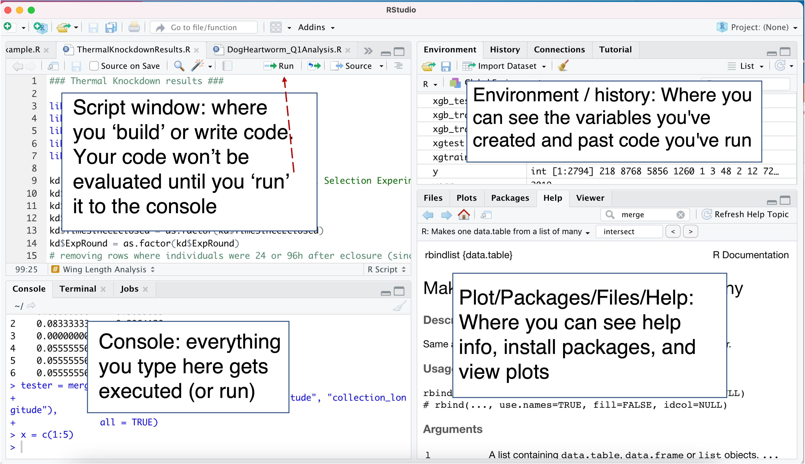

# R Workshop 1 Notes/Overview 

Welcome to R! 

You are now joining the ~1-2 million users worldwide enjoying the wonders of R. 

In today's workshop, we will cover:

1) The layout/functionality of R Studio
2) How to use R functions
3) How to install packages
4) How to import data
5) How to access subsets of data


## Section 1: R Studio Layout ##



  
  
## Section 2: Functions in R ##

'Functions' are how you communicate to R what you are trying to make it do. R has many many built-in functions already! 
Examples include: mean(), subset(), plot()
You can use functions by typing the name of the function and adding arguments within the parantheses
   
   For example:
   ```
   sqrt(101)
   sample(1:10, 3)
   ```
 
## Section 3: Installing packages ##

There are also lots of additional functions not including in 'base' R, but that are part of packages made by other users. To access these, you need to first install the package. This can be done 1 of 2 ways:

1) "Manually" installing the package at the command line using the "install.packages" function
        Ex: ``` 
        install.packages("vegan") ```
        
2) Using R-studio tools. 
      Go to 'packages' tab --> install
      
Both methods require that you "load" the package after installing it and before actually using it.
Again you can do this 1 of 2 ways:
    
1) "Manually" load the library using the "library function" 
        Ex: ```
        library(vegan) 
        ```
        
2) Using R-studio tools.
  In the packages tab, make sure the checkbox is clicked beside the package you want to use
      
  
## Section 4:  Importing data ##

Now you want to use all the snazzy new functions you have available to you on some actual data. You can get your data into R either by manually entering it (only do those for very small datasets) or by importing the data files
    
### Manually entering data ###

Create a new variable (a meaningful but short name that you make up) and set your data equal to this variable.
Use the "c()" function to tell R you are passing it a list of data points rather than a single data point
Ex: 
```
leafsize = c(4.3,6.8,7.0, 11.9, 3.1, 20.0)
```

The above was an example of numerical data but you can also create categorial or character data. 
This requires putting quotation marks around the data points so R doesn't think it's just another variable
Ex: 
```
names = c("A", "A", "B", "B", "C", "C")
```
        
### Importing data ###

This is the recommended method for any dataset larger than a couple rows/columns. 
There are a few different ways to import data:
        
1. Manually import data using the "read" functions: 
These include "read.csv", and "read.table" (which one you use depends on the format of your data file). Using this command, you can specify whether the data you're importing has column names using the 'header' argument. You can also tell R if there are row names using the row.names argument (default is FALSE). Again you'll want to assign the data to a new variable name and use either "=" or "<-" to assign data to that newly created variable
            
Examples: 
 ```
Animals = read.csv("~/Downloads/CA_Animals.csv", header = TRUE, row.names = 1)
Eagles = read.table("~/Downloads/EagleForagingEcology.txt", header = TRUE)
```
              
2. Using R-studio tools
- Go to File --> import dataset --> From text (base) -->
- In the next screen, search for the file you want to upload -->
- In the final screen, confirm that R is planning to upload your data the way you want it
              
Once you've imported your data, there are some nice, quick functions for checking that it looks ok:
Examples: 
```
          head(data)  # Shows the first 6 rows (and all the columns) of your data
          View(data)  # Pulls up the whole dataset in the script window 
          dim(data)   # Provides the dimensions of your data
          str(data)   # Provides info about the class of your dataset (more on that later), the dimensions, and each of the columns
          ```
             
## Section 5:  How to access your data ##

You've now imported data and you want to start using functions/performing calculations on it. There are tons of functions for subsetting/ manipulating data in R (which we'll cover more next week). Today we will mainly be using the square brackets to access data
     
         Eagles[4,2]    # Tells R to look in the "Eagles" dataframe and pull out the 4th row and 2nd column  
         Eagles[4,]     # Tells R to look in the Eagles dataframe and pull out the ENTIRE 4th row
         Eagles[,2]     # Tells R to pull out entire 2nd column
         Eagles[5, 2:4] # Pull out the 5th row, but just columns 2-4
         
  You can assign these data subsets to new variables or perform calculations directly on these subsets.
     
   Ex: SiteC = Animals[3,]
         sum(SiteC)
         
   Ex: Lizards = Animals[,4]
         mean(Lizards)
         
   If you're working with your dataset as a data frame (more on this in the next workshop), you can also the '$' to access columns
    Ex: Animals$Squirrels   # Pulls out the squirrels column
    Ex: range(Aniamsl$Woodrat) # Outputs the min and max number of woodrats at all the sites
 
 
 ## Random other important notes when beginning R ##
 
 * R is case-sensitive! If you define a variable as "g", calling "G" will not work
 * If you're at the console, you can use the up and down arrow keys to see previously entered code (shouldn't really matter because you've been working in the script window!)
 * To run code from the script window, put cursor on that line and hit command+enter for macs or control+enter for PCs
 * The internet is a blessing. Almost any issue you've had in R has been experienced and documented by someone else before. 
  These websites are good: stackoverflow, r-bloggers, cran.r-project
