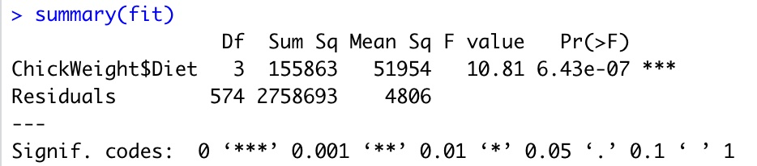
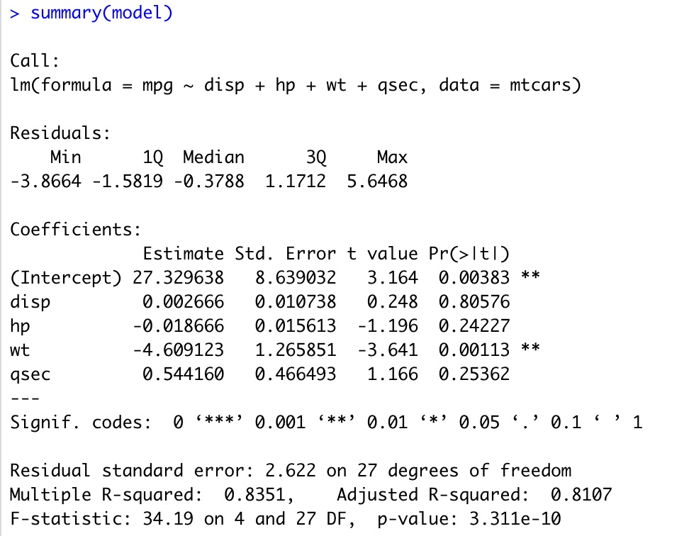
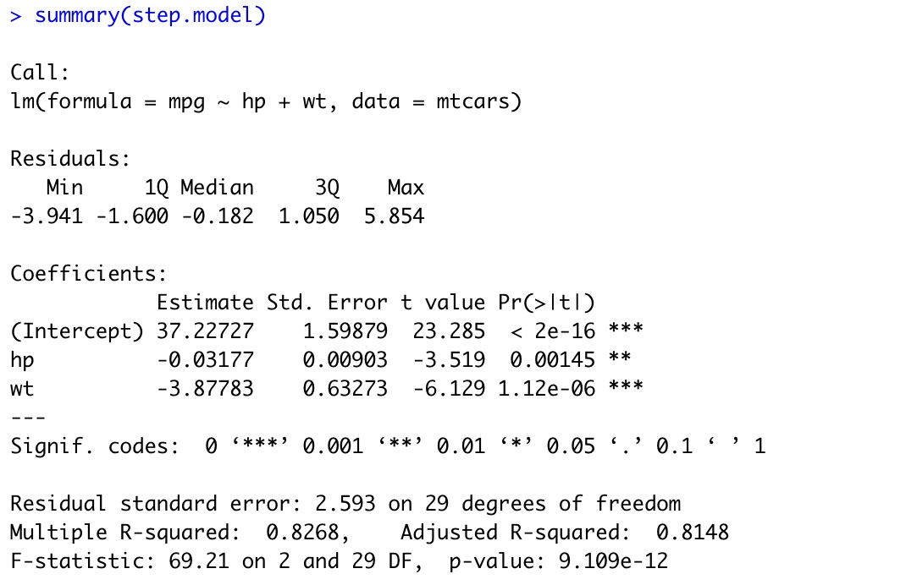

# Week 3: Basic Stats & Plotting #

This week's **learning objectives** are to:

- become familiar with different statistical analyses you can perform in R
- understand how to conduct basic summary statistics on your data 
- feel comfortable looking at help documentation to figure out how to use more advanced functions
- create basic data visualizations

## Section 1: Statistics ##

There are many, many tools for statistical analysis either within base R or contained in other packages. Some examples include: 
Chi-squared, Fisher's exact test, correlations, t-tests, Wilcoxon signed-rank test, multiple regression, cross-validation, variable selection, outlier detection, ANOVAs, power calculations.

There is no need to 'memorize' all of these different tools and functions (nobody does this!). The goal is simply to become familiar with the variety of tools that exist, and to learn to use the help documentation and online examples to make use of the ones we want. 

Below are a few examples of some common statistical procedures.

### Analaysis of Variance (ANOVA) example ###
A statistical test used to analyze the differences in means among groups (e.g., between control and treatment groups, or a group pre- and post-some type of intervention).
[Note that using an ANOVA assumes that your data are independent, normally distributed, and that groups have approximatley equal variances. We'll ignore this for now and assume it's true]

Lets use the ChickWeight dataset from R
```
library(datasets)
View(ChickWeight)
```
This dataset provides info on the weights of chicks on different diets (1-4). You want to see if there's a mean difference in chick weight based on diet. This can be tested statistically using an ANOVA function executed through the "aov" function in base R

```
fit = aov(ChickWeight$weight ~ ChickWeight$Diet)
# OR
fit = aov(weight ~ Diet, data = ChickWeight) # This will achieve the exact same result as the above, its just another way to code it
```
Here, aov is the name of the function that fits an analysis of variance model. The first argument is the dependent or outcome variable. The second argument, after the ~, is the independent variable. To see the results of this model fit:
```
summary(fit)
```



The model output shows there is a significant difference in chick weight based on diet.

### Multiple regression Example ### 
A statistical technique for analyzing the relationship between one or more independent (aka 'predictor' or 'explanatory' variables) on a dependent (or 'outcome' variable)


Lets use the mtcars dataset from R (info about fuel consumption & other features of cars for 32 cars)
```
library(datasets)
head(mtcars)
```

We want to create a model to understand how different car features (independent variables) affect the fuel consumption (dependent variable). We have prior knowledge that displacement, horsepower, weight and 1/4 mile time are all related to fuel consumption. Using this prior knowledge, we can create a model as follows:

```
model = lm(mpg ~ disp + hp + wt + qsec, data = mtcars)
```

Here 'lm' is the function used to fit linear models (with a single or multiple independent variables). Again the left most argument is the outcome variable and the variables after the '~' are the independent variables.

Use the summary command to inspect the model output
```
summary(model)
```


We can see we get estimates of the coefficients, pvalues, info about the R^2, etc. 
But we're not sure that this is the best model (i.e., we may be missing variables or including unnecessary variables), so we want to do a process called 'variable selection' to figure this out. We can do this using tools in the "MASS" package (which you may have already installed)

```
install.packages("MASS")
library(MASS)

```
Now we can use 'stepAIC' function to perform step-wise variable selection. In essense, this process adds or removes independent variables (in a step-wise fashion) to see what combination produces the "best" model.
Take a look at the help documentation for this function to see what arguments are needed to run stepAIC. 

```
?stepAIC
```
Here, we can see the 'direction' argument indciates whether we want variables to be iteratively *added* ("forward"), *removed* ("backward"), or some combination ("both"). If this argument is left blank, the default is backward. If the AIC of the new model (after adding or removing variables) is lower, it keeps going in that direction.
Now lets run the model and insepct the output

```
step.model = stepAIC(model, direction = "both")
summary(step.model)
```

We see that the "best" model includes just horsepower and weight as predictors.

We can also use examine the appropriateness of this "best" model by looking at residuals:
```
plot(step.model)
```


Lets say we received data about two new cars that are being made and we wanted to *predict* their gas mileage based on their horsepower and weight.
We can do that using the information from the model we ran above. 

```
# First we input the data about two new cars:
HondaRoadster = c(145, 2.7) # horse-power and weight
VolvoP1900 = c(150, 4.2)
NewCars = as.data.frame(rbind(HondaRoadster, VolvoP1900))
colnames(NewCars) = c("hp", "wt")
View(NewCars)

predict.lm(step.model, NewCars)
```
Here, the predict.lm function uses the relationship between horsepower, weight, and gas mileage modeled from data we had about other cars to *predict* the gas mileage of two new cars based solely on their horsepower and weight. 
From the model output we see that the Honda Roaster and VolvoP1900 are predicted to get 22.15 and 16.17 mpg, respectively.


