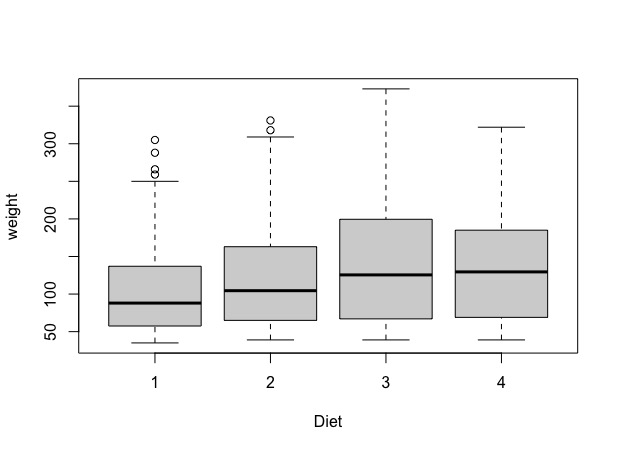

# Week 3: Basic Stats & Plotting #

This week's **learning objectives** are to:

- become familiar with different statistical analyses you can perform in R
- understand how to conduct basic summary statistics on your data 
- feel comfortable looking at help documentation to figure out how to use more advanced functions
- create basic data visualizations

## Section 0: Aggregate function ##

The 'aggregate' function is a very useful, powerful function in R that splits data into subsets & computes some summary statistic on these data subsets. For example, lets look at the 'ChickWeight' dataset in R (included in base R):  

```
library(datasets)
View(ChickWeight)
```
This dataset provides info on the weights of chicks on different diets (1-4). Lets say we want to see if there's a mean difference in chick weight based on diet. We can use the aggregate function to do this like so:
```
aggregate(formula = weight ~ Diet, data = ChickWeight, FUN = mean)
```
Here, the first argument gives the 'formula', where the left side is the variable you are interested in calculating some statistic on (here, weight) and the right side is the grouping variable (here, Diet). The next argument is the dataset you are using and the third argument is the operation you want to perform on the data subsets (here, we want to take the mean). Note the code below would have done the same thing, but without having to call out the arguments to the aggregate function explicitly. 
```
aggregate(weight ~ Diet, ChickWeight, mean)
```

As another example, lets say we want to calculate the minimum weight of the chicks on each day. We could use the aggregate function like so:
```
aggregate(weight ~ Day, ChickWeight, min)
```

## Section 1: Statistics ##

There are many, many tools for statistical analysis either within base R or contained in other packages. Some examples include: 
Chi-squared, Fisher's exact test, correlations, t-tests, Wilcoxon signed-rank test, multiple regression, cross-validation, variable selection, outlier detection, ANOVAs, power calculations.

There is no need to 'memorize' all of these different tools and functions (nobody does this!). The goal is simply to become familiar with the variety of tools that exist, and to learn to use the help documentation and online examples to make use of the ones we want. 

Below are a few examples of some common statistical procedures.

### Analaysis of Variance (ANOVA) example ###
A statistical test used to analyze the differences in means among groups (e.g., between control and treatment groups, or a group pre- and post-some type of intervention).
[Note that using an ANOVA assumes that your data are independent, normally distributed, and that groups have approximatley equal variances. We'll ignore this for now and assume it's true]

Lets return to the chick weight example. We saw that the mean chick weight varied somewhat based on diet. But is this difference statistically significant? We can test this by running an ANOVA in R:
```
fit = aov(weight ~ Diet, data = ChickWeight)
# OR 
fit = aov(ChickWeight$weight ~ ChickWeight$Diet) # This will achieve the exact same result as the above, its just another way to code it
```
Here, aov is the name of the function that fits an analysis of variance model. The first argument is the dependent or outcome variable. The second argument, after the ~, is the independent variable. To see the results of this model fit:
```
summary(fit)
```


The model output shows there is a significant difference in chick weight based on diet.

### Multiple regression Example ### 
A statistical technique for analyzing the relationship between one or more independent (aka 'predictor' or 'explanatory' variables) on a dependent (or 'outcome' variable)


Lets use the mtcars dataset from R (info about fuel consumption & other features of cars for 32 cars)
```
library(datasets)
head(mtcars)
```

We want to create a model to understand how different car features (independent variables) affect the fuel consumption (dependent variable). We have prior knowledge that displacement, horsepower, weight and 1/4 mile time are all related to fuel consumption. Using this prior knowledge, we can create a model as follows:

```
model = lm(mpg ~ disp + hp + wt + qsec, data = mtcars)
```

Here 'lm' is the function used to fit linear models (with a single or multiple independent variables). Again the left most argument is the outcome variable and the variables after the '~' are the independent variables.

Use the summary command to inspect the model output
```
summary(model)
```


We can see we get estimates of the coefficients, pvalues, info about the R^2, etc. 
But we're not sure that this is the best model (i.e., we may be missing variables or including unnecessary variables), so we want to do a process called 'variable selection' to figure this out. We can do this using tools in the "MASS" package (which you may have already installed)

```
install.packages("MASS")
library(MASS)

```
Now we can use 'stepAIC' function to perform step-wise variable selection. In essense, this process adds or removes independent variables (in a step-wise fashion) to see what combination produces the "best" model.
Take a look at the help documentation for this function to see what arguments are needed to run stepAIC. 

```
?stepAIC
```
Here, we can see the 'direction' argument indciates whether we want variables to be iteratively *added* ("forward"), *removed* ("backward"), or some combination ("both"). If this argument is left blank, the default is backward. If the AIC of the new model (after adding or removing variables) is lower, it keeps going in that direction.
Now lets run the model and insepct the output

```
step.model = stepAIC(model, direction = "both")
summary(step.model)
```

We see that the "best" model includes just horsepower and weight as predictors.

We can also use examine the appropriateness of this "best" model by looking at residuals:
```
plot(step.model)
```


Lets say we received data about two new cars that are being made and we wanted to *predict* their gas mileage based on their horsepower and weight.
We can do that using the information from the model we ran above. 

```
# First we input the data about two new cars:
HondaRoadster = c(145, 2.7) # horse-power and weight
VolvoP1900 = c(150, 4.2)
NewCars = as.data.frame(rbind(HondaRoadster, VolvoP1900))
colnames(NewCars) = c("hp", "wt")
View(NewCars)

predict.lm(step.model, NewCars)
```
Here, the predict.lm function uses the relationship between horsepower, weight, and gas mileage modeled from data we had about other cars to *predict* the gas mileage of two new cars based solely on their horsepower and weight. 
From the model output we see that the Honda Roaster and VolvoP1900 are predicted to get 22.15 and 16.17 mpg, respectively.


## Section 2: Data Visualization ##

There are MANY types of plots we can create in R. Some common examples include:
boxplots, scatterplots, piecharts, histograms, heat maps, linecharts

As with statistical analyses, the goal here is simply to become familiar with the variety of tools that exist for plotting, and to learn to use the help documentation and online examples to make use of the ones we want. 

We will just go through a couple basic examples so you get the feel for how these functions work and see what arguments you typically provide in the plotting functions.

### Boxplot Example ###

Lets return to the ChickWeight example from above. After running the ANOVA,  we'd now like to visualize differences in chick weight based on their diets. We can do this by creating a boxplot.

```
boxplot(ChickWeight$weight ~ ChickWeight$Diet)
#OR
boxplot(weight ~ Diet, data = ChickWeight) # exact same result but different way to code it
```
Notice that the arguments used above are structured similarly to the ANOVA



Without having added any additional arguments to the boxplot command, this is the plot we get. There are lots of adjustments we can make to this plot including adding a title, changing the box color, changing the axis limits, changing the text labels, etc.

```
boxplot(weight ~ Diet, data = ChickWeight,
        main = "Chick weight based on diet",    # Adds a tile
        col = c("red", "green", "blue", "yellow"),   # Adds color
        ylim = c(0, 400),  # Adds y-axis bounds (xlim does the same for x-axis)
        xlab = "Chick diet 1-4",   # change the x-axis title
        ylab = "Chick weight in g", # change the y-axis title
        cex.main = 2 # increase the size of the title text by a factor of 2
        cex.lab = 1.5) # increase the size of the axes labels by a factor of 1.5
```


Much better! Although the colors could always be prettier. Here's a nice guide to the various color options available in R: https://www.nceas.ucsb.edu/sites/default/files/2020-04/colorPaletteCheatsheet.pdf

There are additional arguments we could have included as well (e.g., rotating the axes text, changing the size of spacing of the axis tick marks, etc.).
Here is a nice guide on the different plotting arguments you can specify: https://r-coder.com/plot-r/

### Scatterplot Example ####

Lets return to the mtcars dataset and visualize the relationship between gas milesage and weight with a scatterplot.
```
plot(mpg ~ wt, data = mtcars)
# Notice that the command to create a scatterplot is simply "plot" 
```


Without adding any additional plotting arguments, this is the plot we get.

As in the boxplot example, we can spruce up this plot by adding arguments to the plot function.
```
plot(mpg ~ wt, data = mtcars,
     main = "Effect of car weight on gas milesage",
     col = "#9F2B68",   # notice that we can supply a hexcode or a color name 
     pch = 16,    # changes the plotting "symbol"
     cex = 1.8,    # increase the size of the plotting symbol
     xlab = "Car Weight (1000 lbs)",
     ylab = "Miles per gallon")
```


We can also add a line of best fit to the plot, using the linear model command we used above.
```
Model2 = lm(mpg~ wt, data = mtcars)
abline(Model2, col = "red")  # the abline function adds straight lines to a plot
text(x = 4.8, y= 31.6, labels = "R2 = 0.753")  # add text to the plot indicating the R2 (correlation). 
# The x and y arguments above denote where on the plot to place the text
```


## Section 3: Data Visualization using ggplot ###

There is another plotting package commonly used in R, called 'ggplot.' It takes a bit more getting used to (the syntax can be tricky), but some people prefer it because it gives you more control over the different plotting parameters. [If using ggplot feels overwhelming right now, that's ok! Plenty of people just use the base R plotting functions to create beautiful visualizations.]

Let's use ggplot to create a scatterplot using the mtcars dataset.

```
install.packages("ggplot2")
library(ggplot2)

ggplot(mtcars, aes(x=wt, y=mpg)) +     # aes here refers to 'aesthetics'
  geom_point(size=4, shape= 1, col = "red") +  # add points to the plot, specifiying the size, shape, and color  
geom_text(label=rownames(mtcars), size = 2) +          # add labels next to the plotted points
  geom_smooth(method=lm, se = FALSE, linetype = "dashed", col = "black") +   # add a line of best fit to the plot
  labs(x = "weight", y = "gas mileage")  +   # adds x and y axis labels
  theme_bw()     # controls the "theme" for the plot. Other options include theme_minimal(), theme_light(), theme_dark(), theme_classic(), etc.
``` 
Unlike the previous plotting functions we saw, ggplot uses the '+' command to add additional components to the plot.


